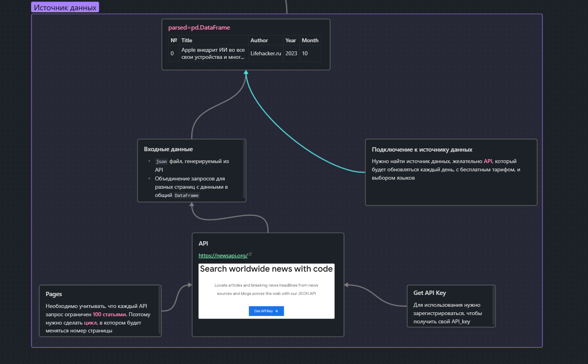
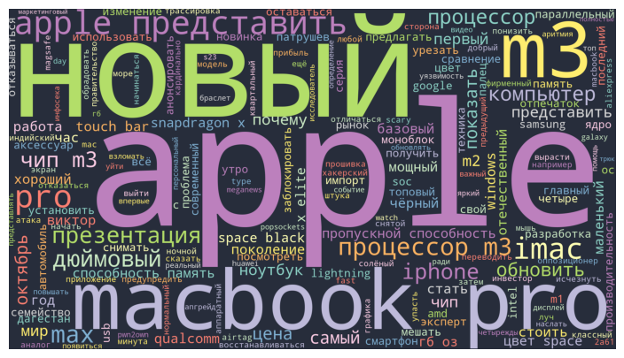

# Парсинг Новостных статей
## Предисловие

Приветствую читателей канала [ТУЧ](http://vk.com/tuuch) ! 
Меня зовут Сергей, сегодня мы изучим методы обработки и анализа **текстовых данных**.

>[!info] Идеальное решение задачи
>Хочется сделать всё таким образом, чтобы программа:
>1. Брала информацию из **новостных статей** по всему миру, сортировала и **обрабатывала** данные.
>2. Брала информацию по **акциям фирмы**, которую мы хотим проанализировать
>3. Пыталась найти **зависимость** между **частотой появления** слов и **ростом** или падением акций


# Глава 1. Новостной парсинг

В этой статье мы изучим только **Парсинг Новостей, обработку начальных данных, визуализацию частот появления слов.**

Для представления решения воспользуемся canvas доской


Полностью написанный код вы можете прочитать и скопировать в самом конце [^1]

Также конечная программа будет сверять данные с личным файлом, в котором будет сохранять результаты для дальнейшего анализа.
Выглядеть это будет так:


## API

Кстати, для написания всех своих проектов я использую Obsidian. И вы только посмотрите, какие возможности тут появились! Это Obsidian Canvas, поэтому в дальнейшем привыкайте к тому, что такие интеллект-карты будут появляться (Обещаю, я буду делать их потом информативнее и проще для понимания, где будут использоваться только **заголовки или важная информация**).



Пользоваться будем одним из самых популярных новостных API систем, https://newsapi.org/
1. Регистрируемся
2. Получаем свой API key
3. Пользуемся)
	Повезло, что существует бесплатный тариф, правда и с ограничением, важным ограничением - 
	- Новости можно получать только за 1 день до текущего дня

Можно подключиться к API, используя библиотеку `request` в Python. Давайте с этого и начнем.

```python
url = ('https://newsapi.org/v2/everything?'
              'q=Apple&'
              'language=ru&'
              # 'country=fr&'
              f'from={prep_date.year}-{prep_date.month}-{prep_date.day}&'
              f'to={prep_date.year}-{prep_date.month}-{prep_date.day}&'
              f'page={page_n}&'
              'sortBy=popularity&'
              'apiKey=108adbad1d494f379a818f40aec19b41')

       response = requests.get(url)
       data=response.json() # Преобразовываем данные в json формат (словарь)
```

Для удобства можно записать `url` с настройкой в отдельной переменной. 
`newsapi.org` очень вариативен, и при написании запроса есть много разных настроек:
- Ключевое слово `'q=Apple&'`
	Можно получать именно те новости, которые нужно именно вам
- Язык новостей `'language=ru&'`
	API поддерживает **более 12 популярных языков**, с полным списком можете **ознакомиться** на сайте `newsapi.org`
- Страна источника `'country=fr&'`
	В данной задаче **не используется**, потому что часть функций временно блокируется, или из-за повсеместной блокировки РФ, или из-за разнородности данных
- Диапазон дат `'from=&'` и `'to=&'`
	Можно оставить только одно из ограничений, чтобы, к примеру, искать всё вплоть то **текущего дня**
- Страница `'page=2&'`
	Существует ограничение по весу запроса API. Здесь ограничение происходит по **100 статьям за 1 запрос**. Если не ошибаюсь, ограничение по **количеству** запросов в минуту = `100 запросов/минуту`. Поэтому была добавлена возможность отображения данный с определенной страницы.
	В нашей программе для сбора информации со всех страниц можно использовать цикл `for`, изменение параметра № страниц через использование `f-строк`
	```python

dates=[]
titles=[]
descriptions=[]
authors=[]
pages=data['totalResults']//100

for state in data['articles']:
	  dates.append(state['publishedAt'])
	  titles.append(state['title'])
	  descriptions.append(state['description'])
	  authors.append(str(state['source']['name']))

if pages>1:
	  for i in range(2,data['totalResults']//100+2):

			 page_n=i
			 url = ('https://newsapi.org/v2/everything?'
					'q=Apple&'
					'language=ru&'
					# 'country=fr&'
					f'from={prep_date.year}-{prep_date.month}-{prep_date.day}&'
					f'to={prep_date.year}-{prep_date.month}-{prep_date.day}&'
					f'page={page_n}&'
					'sortBy=popularity&'
					'apiKey=108adbad1d494f379a818f40aec19b41')
			 response = requests.get(url)
			 data=response.json()

			 if data["status"]=="ok":
					for state in data['articles']:
						   dates.append(state['publishedAt'])
						   titles.append(state['title'])
						   descriptions.append(state['description'])
						   authors.append(str(state['source']['name']))
			 else:
					print(f"Произошла ошибка на странице {page_n}. Код: {data['status']}")

parsed["Date"]=dates
parsed["Title"]=titles
parsed["Describe"]=descriptions
parsed["Author"]=authors

assert len(parsed)!=0, 'Кол-во строк равно нулю, тут точно ошибка'
	```
	Также записываем все результаты в `pandas.DataFrame()`.
	Если же вдруг, новостей за день нет (такое возможно при изменении **Ключевого слова**), пока пишется ошибка. Потом можно будет реализовать это в виде функции, чтобы выводился текст отсутствия данных.


- Сортировка
	Есть сортировка **по популярности** и **по дате**. В нашей задаче не имеет значения тип сортировки, потому что мы проводим полный анализ внутренних данных


## Предобработка данных

Мы успешно собрали все данные, но если вдруг вы скажете - "**Всё, считаем частоты появления слов, находим максимальное**", то *СТОП!*

>[!faq] В чем же проблема?
>Нерешенной проблемой является могучий и великий русский язык. В каждой статье все слова написаны с разными окончаниями, падежами, множественными числами и так далее. Также перед анализом нужно убрать так называемые **СТОП-слова**, которые нам не нужны, это местоимения, предлоги, или дополнительные слова, которые могут быть специально вставлены сайтом-поставщиком (Одним из примеров является сайт `лайфхакер`). Поэтому в идеале нужно привести все слова к первоначальной форме. Для этого можно воспользоваться разными библиотеками, как `wordcloud`, `pymorphy2`, `nltk`

### СТОП-слова

Давайте по порядку воспользуемся преобразованиями. В первую очередь рассмотрим слова, которые **изначально** нам придется убрать из рассмотрения.

Список таких слов представлен в библиотеке **nltk**. К тому же можно быстро поставить будет абсолютно любой язык для анализа, таким образом программа после замены параметра `language='russian'` на `language='french` можно рассматривать стоп-слова из французского языка. Если же вы вдруг не хотите быть гибкими, можете не использовать эту библиотеку, а самостоятельно написать список этих слов.

```bash
pip install nltk
```

Код со СТОП-словами:
```python
from nltk.corpus import stopwords
stop_words = stopwords.words('russian')

stop_append=[',','.','%',
	  ':','—','«','»','лайфхакер','подкаст',
	  'который',
	  'нрф',
	  'ия',
	  ]
stop_words=stop_words+stop_append
```
(Я дополнительно добавил некоторые слова, которые не хочу видеть в результатах)

### Преобразование слов в первоначальную форму

Теперь, когда у нас есть **DataFrame** со всеми статьями, давайте их переведем в тот формат, который примут другие библиотеки для анализа, `Wordcloud` и `pymorphy2`.

```bash
pip install wordcloud
pip install pymorphy2
```

Формат, который принимают функции `list: список`, а значит давайте объединим все статьи в единую строку, потом все слова в список разделим через 

```python
from nltk.tokenize import word_tokenize
text = ' '.join(parsed['Title'])
       # print(type(text)) 
       # разбиваем текст на токены
       # в результате получаем переменную типа list со списком токенов
       text = word_tokenize(text,) # 
```

Но перед тем как у вас получится запустить `nltk`, нужно установить все дополнительные библиотеки
### Как запустить nltk

1. Запустите консоль
2. Запустите python, написав в консоли `python`
3. Запустите `NLTK Downloader` командами
	```PYTHON
	import nltk.downloader
	nltk.download()
	```

 


```python
# инициализируем лемматайзер MorphAnalyzer()
lemmatizer = pymorphy2.MorphAnalyzer()

# функция для лемматизации текста, на вхд принимает список токенов 
def lemmatize_text(tokens):
# создаем переменную для хранения преобразованного текста
	  text_new=''
	  # для каждого токена в тексте
	  for word in tokens:
			 # с помощью лемматайзера получаем основную форму
			 word = lemmatizer.parse(word)
			 # добавляем полученную лемму в переменную с преобразованным текстом
			 text_new = text_new + ' ' + word[0].normal_form
	  # возвращаем преобразованный текст
	  return text_new

text=[word for word in text if word not in stop_words]

# вызываем функцию лемматизации для списка токенов исходного текста
text = lemmatize_text(text)
```

После запуска все слова преобразуются в их начальную форму.

### Облако слов

Наверное, вы видели в интернете картинки со словами разных размеров:


Чтобы получить такую фотографию, воспользуемся библиотекой
```python
from wordcloud import WordCloud
# генерируем облако слов
cloud = WordCloud(stopwords=stop_words, width=1920, height=1080,random_state=4, 
                            contour_width=10, contour_color='#2e3043', background_color='#272d3b', colormap='Set3' ).generate(text)
       plt.figure(figsize=(9,5))
       plt.imshow(cloud)
       plt.axis('off')
```

Фотография выше как раз и пример использования данной программы.

Кстати, на момент написания статьи прошла презентация от **Apple**, где они показали новых макбук на новом процессоре m3. Давайте посмотрим, Хорошо ли наша программа работает, сможет ли что-то из этого она самостоятельно подчеркнуть? 
Смотрим ниже, и...



Ну и берем из этого облака значения, **сохраняем** их в отдельных **фрейм**.

```python
N_top=100
if len(cloud.words_.items())<N_top:
	  N_top=len(cloud.words_.items()) # Либо 100 слов из топа, либо меньше, если столько нет

titles=[]
scores=[]
years=[prep_date]*N_top

i=0
for word in cloud.words_.items():
	  if i<N_top and i<len(cloud.words_.items()):
			 titles.append(word[0])
			 scores.append(word[1])
			 i+=1

df_current=pd.DataFrame()
df_current["Name"]=titles
df_current["Score"]=scores
df_current["Date"]=years

# print(df_current.head(10))
df_date=pd.concat([df_date,df_current]) # Записываем их в общий фрейм, чтобы несколько раз для нескольких дат собирать информацию.

```

Таким образом теперь мы получаем и фотографии, которые могут быть интересными, и данные, по которым в будущем сможем делать различные анализы.

df_date:

| № |  Name   | Score     |   Date         |
| ---- | -------- | -------- | ---------- |
|0|apple|1.000000|2023-10-31|
|1|новый|0.805556|2023-10-31|
|2|macbook pro|0.805556|2023-10-31|
|3|m3|0.722222|2023-10-31|
|4|apple представить|0.555556|2023-10-31|
|...|...|...|...|

---
# Продолжение следует

В следующей главе мы разберем вторую API, по которой мы будем собирать уже рост и падение акций по дням, а в заключительной главе мы объединим эти два проекта, чтобы создать программу, которую я назову **Пророком**.

[^1]: Просто быстрый переход в самый конец
Код ниже я доделал, вставив это всё в функцию, добавив возможность удобной конфигурации настроек, а также запись в файл всех значений для долгосрочного анализа

```python
def News_parser(N_days=3,quote='Apple',N_top=100,API='108adbad1d494f379a818f40aec19b41',cloud_png=True,save_data=True, save_file='new_parse.csv',language='ru'):

       """
       Данный парсер предназначен, в первую очередь, для личного использования,
       а не для коммерческих целей. API следует поменять на свой в первую же очередь,
       однако, мой бесплатный всё равно мне не жалко. Пользуйтесь!
       Внимание, так как мой API имеет уровень доступа Developer, то я могу посмотреть лишь 500 запросов.
       Я добавил автоматическое определение премиумного аккаунта.
       ---------------------------------
       Описание переменных:
       N_days - Кол-во дней до текущего дня, по которым будем собираться анализ
       quote - Ключевые слова запроса на поиск новостей
       N_top - Максимальное кол-во слов, которое будет записано в БД
       API - ваш api с newsapi.org
       language - язык поиска новостей
       save_data - сохранять ли значения в файл
       save_file - название файла, куда будут записываться результаты
       cloud_png - рисовать ли Cloud картинки
       """

       import requests
       import pandas as pd
       import datetime

       was_file=False

       if language=='ru':
              stopword_lang='russian'
       if language=='en':
              stopword_lang='english'


       if save_data:
              import os
              path='data/'+save_file

              if not os.path.exists('data/'):
                     os.mkdir("data")

              if os.path.exists(path):
                     df_date=pd.read_csv(path)
                     was_file=True
              else:
                     df_date=pd.DataFrame() # Фрейм с готовыми скорингами слов с разбиением по датам
       
       else:
              df_date=pd.DataFrame() # Фрейм с готовыми скорингами слов с разбиением по датам
       

       for num in range(1,N_days+1):
              
              page_n=1
              current_date = datetime.datetime.today().date()
              prep_date=(current_date-datetime.timedelta(days=num))

              can_do=True
              if was_file:
                     
                     if len(df_date.loc[(df_date["Theme"]==quote) & (df_date['Date']==str(prep_date)) & (df_date['Language']==language)])>0:
                            print(f"Be careful next, found the same quote-{quote} on date-{prep_date} ")
                            can_do=False
                     else:
                            can_do=True
              if can_do:
                     print(f"Парсинг на дату: {prep_date}\n-------------------------------")

                     url = ('https://newsapi.org/v2/everything?'
                            f'q={quote}&'
                            f'language={language}&'
                            # 'country=fr&'
                            f'from={prep_date.year}-{prep_date.month}-{prep_date.day}&'
                            f'to={prep_date.year}-{prep_date.month}-{prep_date.day}&'
                            f'page={page_n}&'
                            'sortBy=popularity&'
                            f'apiKey={API}')

                     response = requests.get(url)
                     data=response.json() # Преобразовываем данные в json формат (словарь)
                     
                     # Раскоментить если хочется посмотреть какого формата ответы
                     # print(json.dumps(data, indent=4, sort_keys=True, ensure_ascii=False)) # без параметра ensure_ascii=False будет слетать кодировка и вместо русских символов будет \u0412\u0438\u043a\u0442
                     # print(data['totalResults']//100)

                     parsed=pd.DataFrame()
                     dates=[]
                     titles=[]
                     descriptions=[]
                     authors=[]

                     pages=data['totalResults']//100

                     for state in data['articles']:
                            dates.append(state['publishedAt'])
                            titles.append(state['title'])
                            descriptions.append(state['description'])
                            authors.append(str(state['source']['name']))

                     if pages>1:
                            for i in range(2,data['totalResults']//100+2):

                                   page_n=i
                                   url = ('https://newsapi.org/v2/everything?'
                                          f'q={quote}&'
                                          f'language={language}&'
                                          # 'country=fr&'
                                          f'from={prep_date.year}-{prep_date.month}-{prep_date.day}&'
                                          f'to={prep_date.year}-{prep_date.month}-{prep_date.day}&'
                                          f'page={page_n}&'
                                          'sortBy=popularity&'
                                          f'apiKey={API}')
                                   response = requests.get(url)
                                   data=response.json()

                                   if data["status"]=="ok":
                                          for state in data['articles']:
                                                 dates.append(state['publishedAt'])
                                                 titles.append(state['title'])
                                                 descriptions.append(state['description'])
                                                 authors.append(str(state['source']['name']))
                                   else:
                                          if "Developer accounts are limited" in data["message"]:
                                                 print('Достигли ограничения по запросам для dev-acc. Прекращаем')
                                                 break
                                          print(f"Произошла ошибка на странице {page_n}. Код: {data['status']}")

                     parsed["Date"]=dates
                     parsed["Title"]=titles
                     parsed["Describe"]=descriptions
                     parsed["Author"]=authors

                     if len(parsed)==0:
                            print(f"Данных по ключу-{quote}, на дату-{prep_date} = НЕТ\nВозможно данных просто нет, или же данные пока не появились, попробуйте позже повторить запрос")
                     else:

                            def cutter(x,n):
                                   if n==1:
                                          return int(x[0:4])
                                   if n==2:
                                          return int(x[5:7])
                                   if n==3:
                                          return int(x[8:10])
                                   
                            parsed['Year']=parsed['Date'].apply(lambda x: cutter(x,1))
                            parsed['Month']=parsed['Date'].apply(lambda x: cutter(x,2))
                            parsed['Day']=parsed['Date'].apply(lambda x: cutter(x,3))

                            parsed.drop(['Describe'],axis=1,inplace=True) # Можно и оставить
                            parsed.drop(['Date'],axis=1,inplace=True) # Можно и оставить

                            parsed.drop_duplicates()

                            from wordcloud import WordCloud
                            import matplotlib.pyplot as plt
                            
                            # Импортируем библиотеку для лемматизации русских и украинских слов
                            import pymorphy2
                            # Импортируем метод word_tokenize из библиотеки nltk
                            from nltk.tokenize import word_tokenize 
                            
                            from nltk.corpus import stopwords
                            stop_words = stopwords.words(stopword_lang)

                            stop_append=[',','.','%',
                                   ':',
                                   '—',
                                   '«',
                                   '»',
                                   'лайфхакер',
                                   'подкаст',
                                   'который',
                                   'нрф',
                                   'ия',
                                   '',
                                   '',
                                   '',
                                   ]
                            stop_words=stop_words+stop_append

                            text = ' '.join(parsed['Title'])
                            # print(type(text)) 
                            # разбиваем текст на токены
                            # в результате получаем переменную типа list со списком токенов
                            text = word_tokenize(text,)

                            # инициализируем лемматайзер MorphAnalyzer()
                            lemmatizer = pymorphy2.MorphAnalyzer()
                            
                            # функция для лемматизации текста, на вхд принимает список токенов 
                            def lemmatize_text(tokens):
                            # создаем переменную для хранения преобразованного текста
                                   text_new=''
                                   # для каждого токена в тексте
                                   for word in tokens:
                                          # с помощью лемматайзера получаем основную форму
                                          word = lemmatizer.parse(word)
                                          # добавляем полученную лемму в переменную с преобразованным текстом
                                          text_new = text_new + ' ' + word[0].normal_form
                                   # возвращаем преобразованный текст
                                   return text_new
                            
                            text=[word for word in text if word not in stop_words]

                            # вызываем функцию лемматизации для списка токенов исходного текста
                            text = lemmatize_text(text)
                            # генерируем облако слов
                            cloud = WordCloud(stopwords=stop_words, width=1920, height=1080,random_state=4, 
                                                 contour_width=10, contour_color='#2e3043', background_color='#272d3b', colormap='Set3' ).generate(text)
                            
                            if cloud_png:
                                   plt.figure(figsize=(9,5))
                                   plt.imshow(cloud)
                                   plt.axis('off')


                            if len(cloud.words_.items())<N_top:
                                   N_top=len(cloud.words_.items())

                            titles=[]
                            scores=[]
                            years=[prep_date]*N_top
                            quotes=[quote]*N_top
                            langs=[language]*N_top
                            i=0
                            for word in cloud.words_.items():
                                   if i<N_top and i<len(cloud.words_.items()):
                                          titles.append(word[0])
                                          scores.append(word[1])
                                          i+=1

                            df_current=pd.DataFrame()
                            df_current["Name"]=titles
                            df_current["Score"]=scores
                            df_current["Date"]=years
                            df_current["Theme"]=quotes
                            df_current['Language']=langs
                            # print(df_current.head(10))
                            df_date=pd.concat([df_date,df_current])

       print(f"Парсинг прошёл успешно")
       print(df_date.head(3))
       if save_data:
              df_date.to_csv(path, index=False)
       else:
              return df_date


```

Данный код советую скопировать в удобный для вас компилятор, и после уже читать.

Также Конфигурация с запуском выглядит так:
```python
N_days=5
quote='Google'
N_top=100
API='108adbad1d494f379a818f40aec19b41'
cloud_png=True
save_data=True
save_file='new_parse.csv'
language='en'
News_parser(N_days=N_days,quote=quote,N_top=N_top,API=API,cloud_png=cloud_png,save_data=save_data, save_file=save_file,language=language)
```

